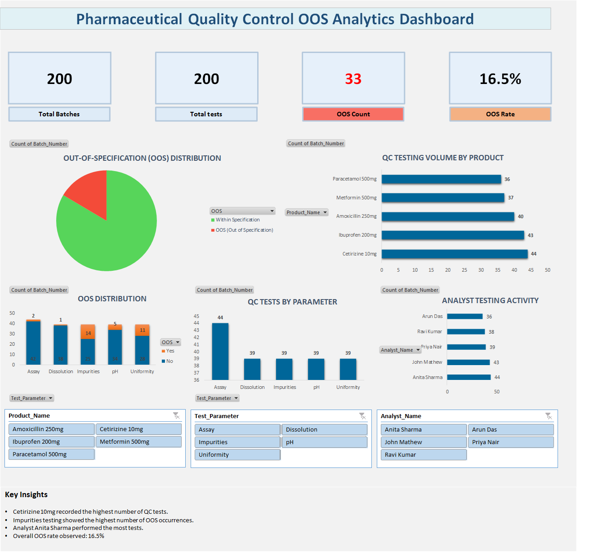

# Pharmaceutical QC Analytics- Root Cause Analysis of OOS Trends

Data analytics dashboard analyzing Out-of-Specification (OOS) trends in pharmaceutical Quality Control laboratories.

## Project Overview

This project analyzes Out-of-Specification (OOS) trends in pharmaceutical Quality Control laboratories using data analytics techniques.
The objective is to identify patterns in QC testing data that may contribute to OOS results and provide insights that support proactive quality monitoring.

## Business Problem

Pharmaceutical QC laboratories generate large volumes of analytical testing data. However, this data is often underutilized for identifying trends in laboratory performance and quality deviations.

Recurring OOS results require detailed investigations which can delay batch release and increase operational workload.
A data-driven analytics approach is required to identify testing patterns and potential root causes behind OOS occurrences.

##Project Objectives

- Analyze QC testing activity across pharmaceutical products
- Evaluate testing distribution across analytical parameters
- Monitor analyst workload distribution
- Identify trends in OOS occurrence
- Support data-driven quality monitoring

## Tools Used

- Microsoft Excel
- Pivot Tables
- Data Visualization
- Dashboard Development

## Dashboard Insights

- Total batches analyzed: 200
- Overall OOS rate: 16.5%
- Testing activity concentrated across key parameters including Assay, Dissolution, and Impurities
- Analyst workload distribution shows relatively balanced testing allocation

## Business Impact

Data-driven QC analytics enables laboratories to:
- Identify potential quality risks earlier
- Improve investigation efficiency
- Monitor laboratory performance
- Support regulatory compliance

## Dashboard Preview
Full case study available in the PDF below.
Download to explore the complete analysis and insights.

